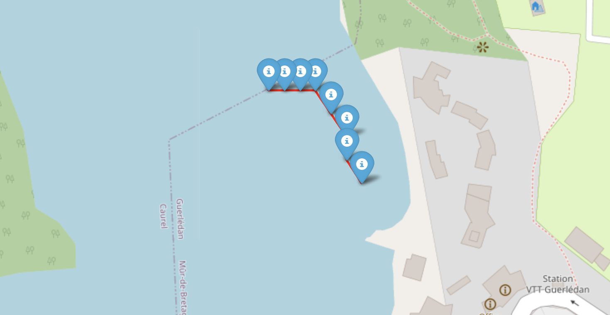

# Mission
The goal was to implement control laws to guide the thrusters of a Differential Drive Boat to reach a specific location on the lake. 
The control law applied is as follows:
```
d = \sqrt{(x1-x)(x1-x) + (y1-y)(y1-y)}
\phi = normalized\_angle(\phi d - \phi c)
k\_linear = (d/100)*5
k\_angular = 2

linear_velocity = k\_linear*d
angular\_velocity = k\_angular*w

right\_thurster - left\_thruster = A*w
```
The following figure illustrates the boat's path, adjusted according to the minimization plan for heading difference and distance.

